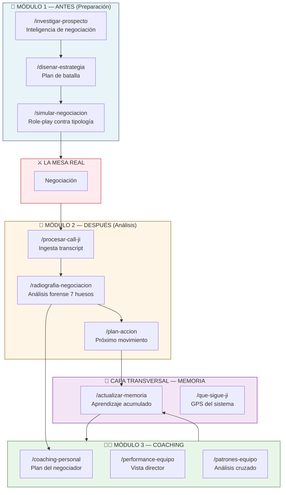
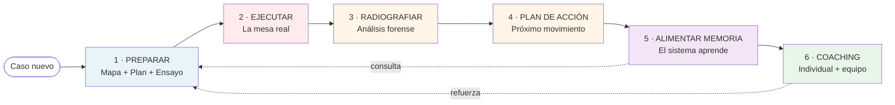

# 🎯 JIT Sales OS

> **Sistema operativo de negociación construido sobre el método de José Ignacio Tobón.**
> Un asistente que acompaña el ciclo completo de una mesa: antes, durante, después y a nivel organizacional.

> [!quote] José Ignacio Tobón
> *"Estructura, no improvisación. Sin mapa, se negocia a ciegas."*

---

## 📌 Resumen en una página

> [!abstract] Qué es
> **JIT Sales OS** es una capa de inteligencia aplicada que toma el método JIT —los 7 huesos, las 6 preguntas, la ecuación del estrés, la regla 95/5, las tipologías, los mandamientos— y lo convierte en un asistente operacional para el negociador, el director y la organización.
>
> No es ChatGPT ni una herramienta genérica. Es un sistema donde **el método JIT es la única autoridad**: cada acción del sistema consulta el framework antes de operar. Si el framework evoluciona, el sistema se recalibra.

> [!success] Tres promesas concretas
> 1. **Al negociador** — entra a cada mesa con un plan de batalla escrito, ensaya contra el peor escenario y recibe una radiografía forense de su desempeño.
> 2. **Al director** — audita 50 negociaciones con la profundidad con la que antes auditaba 2. Sabe quién necesita qué coaching y con qué urgencia.
> 3. **A la organización** — cada negociación procesada hace al sistema más inteligente. La memoria corporativa acumula objeciones, tipologías y patrones ganadores.

---

## 🧭 El punto de partida — el problema que este sistema resuelve

> [!warning] Las 5 razones por las que fracasan las negociaciones (JIT)
> 1. Temor al conflicto
> 2. Falta de planificación estructurada
> 3. Anclarse en posiciones rígidas
> 4. No crear ni capturar valor adicional
> 5. No identificar suficientemente el poder disponible

El método JIT diagnóstica estos errores con precisión quirúrgica. El problema práctico es que **aplicar el método en cada negociación requiere una disciplina que pocas organizaciones sostienen**: las 6 preguntas rara vez se responden por escrito, las tipologías rara vez se mapean antes de la mesa, y las calls rara vez se analizan contra los 7 huesos después.

> [!tip] La tesis
> Si el método es **reproducible, medible y verificable** (los principios rectores del método JIT), entonces puede **operacionalizarse en un sistema asistido por IA** que garantiza la disciplina y acumula aprendizaje.
>
> El sistema no reemplaza al negociador. **Le sube las capacidades** — exactamente como la ecuación del estrés lo prescribe:
>
> **Estrés = Metas − Capacidades.**
>
> El mediocre baja sus metas. El estratega sube sus capacidades. **El sistema sube las capacidades sistemáticamente.**

---

## 🏛️ Arquitectura del sistema

Tres módulos operacionales + una capa transversal de memoria. Cubren las 4 fases del método JIT (Diagnóstico, Preparación, Negociación, Captura).

> [!info] Lectura del diagrama
> - **Módulo 1** se ejecuta antes de la mesa. Produce un plan de batalla escrito que responde las 6 preguntas y mapea las tipologías.
> - **Módulo 2** se ejecuta después de la mesa. Produce una radiografía forense contra los 7 huesos, con scores y hard caps.
> - **Módulo 3** se ejecuta periódicamente. Mira la trayectoria del negociador y del equipo para generar coaching individualizado y detectar patrones cruzados.
> - **La memoria** vive en el centro: cada caso la alimenta, y cada nuevo caso la consulta antes de operar.

---

## 🔄 El flujo completo — de la preparación al aprendizaje

> [!example] Un caso de principio a fin
>
> **Lunes 10 am.** El negociador tiene una reunión crítica el jueves con un cliente grande. Corre `/investigar-prospecto` → en 5 minutos tiene un **mapa de la negociación**: intereses probables del otro, BATNA estimado, tipología proyectada, decisor real identificado.
>
> **Lunes 11 am.** Corre `/disenar-estrategia` → en 10 minutos tiene un **plan de batalla**: las 6 preguntas respondidas por escrito, ZOPA con excelente/bueno/aceptable, 5 variables de rentabilidad infinita priorizadas, anclaje inicial con guion palabra por palabra.
>
> **Miércoles 3 pm.** Corre `/simular-negociacion --tipologia hp --intensidad combate` → 30 minutos practicando contra Claude jugando al cliente más difícil posible. Al final, una evaluación contra los 7 huesos y 3 acciones específicas para ajustar.
>
> **Jueves 10 am.** Ejecuta la mesa real. Fireflies graba.
>
> **Jueves 11 am.** Corre `/procesar-call-ji` → el transcript se estructura por segmentos (apertura, exploración, propuesta, objeciones, cierre), con diagnóstico express de tipología confirmada.
>
> **Jueves 2 pm.** Corre `/radiografia-negociacion` → radiografía forense: score global, scorecards por cada uno de los 7 huesos con citas textuales, errores críticos detectados, momentos pivotales con veredicto, plan vs ejecución, 3 acciones para la próxima mesa.
>
> **Jueves 3 pm.** Corre `/plan-accion` → próximo movimiento concreto con timing táctico, variables nuevas a meter, script listo para enviar.
>
> **Jueves 3:15 pm.** Corre `/actualizar-memoria` → la objeción que apareció, la respuesta que ganó, la tipología confirmada — todo queda indexado para que el próximo caso del equipo empiece con esa inteligencia ya puesta.

---

## 🎭 Los 10 skills del sistema

### Módulo 1 — ANTES

> [!note]- **`/investigar-prospecto`** — Inteligencia de negociación
> **No es un brief de empresa. Es un mapa de la mesa.**
>
> - **Input:** nombre del caso + URL/contexto básico
> - **Output:** *Mapa de la Negociación* estructurado contra los 7 huesos
>   - Intereses probables (con evidencia) + miedos simétricos del otro
>   - BATNA estimado de la contraparte + costo de salida
>   - 5+ variables de rentabilidad infinita pre-identificadas
>   - Criterios objetivos disponibles para defender tus cifras
>   - Tipología estimada con nivel de confianza y evidencias
>   - Decisor real mapeado con "qué significa victoria para él"
>   - Información privilegiada faltante — qué preguntar en la próxima interacción
> - **Principio JIT aplicado:** Sin mapa, se negocia a ciegas.

> [!note]- **`/disenar-estrategia`** — Plan de batalla
> **Las 6 preguntas respondidas por escrito. Condición innegociable según JIT.**
>
> - **Input:** el mapa del skill anterior
> - **Output:** *Plan de Batalla operacional*
>   - Las 6 preguntas respondidas textualmente
>   - ZOPA definitiva: excelente / bueno / aceptable con cifras
>   - Anclaje inicial preparado con guion palabra por palabra + criterio que lo defiende
>   - Variables de rentabilidad infinita priorizadas con orden táctico
>   - Tipología anticipada con plan de juego contingente
>   - Manejo de objeciones probables con scripts JIT
>   - Saving face pre-diseñado para la contraparte
>   - Pre-mortem con 3 escenarios
>   - Checklist de entrada a la mesa
> - **Principio JIT aplicado:** La improvisación es el error no forzado que destruye el margen.

> [!note]- **`/simular-negociacion`** — Role-play contra tipología
> **El negociador enfrenta al peor escenario posible en ensayo para que la mesa real se sienta fácil.**
>
> - **Input:** el caso + tipología a simular (Firme / Suave / Duro / Soviético / HP) + intensidad (ensayo / combate / pesadilla)
> - **Comportamiento:** Claude encarna al prospecto con los intereses, tipología, tics conductuales y lenguaje característico. No rompe personaje salvo con comandos explícitos (`pausa`, `stop`, `hint`, `reset`).
> - **Output final:** evaluación contra los 7 huesos, momentos pivotales, errores críticos detectados, 3 acciones para la mesa real.
> - **Principio JIT aplicado:** El HP admira el carácter, no la complacencia. Se entrena contra el HP real, no contra una versión suavizada.

### Módulo 2 — DESPUÉS

> [!note]- **`/procesar-call-ji`** — Ingesta de transcripts
> **Preprocesador que prepara el material crudo para análisis forense.**
>
> - **Input:** transcript desde Fireflies (MCP), archivo, o paste directo
> - **Output:**
>   - Transcript estructurado por segmentos (apertura / exploración / propuesta / objeciones / cierre)
>   - Highlights automáticos (cifras, anclas, objeciones, silencios, ratio de palabras)
>   - Diagnóstico express de tipología con citas textuales
>   - Comparación preliminar plan vs ejecución
> - **Principio JIT aplicado:** Reproducible, medible, verificable.

> [!note]- **`/radiografia-negociacion`** — Análisis forense
> **El corazón del sistema. Cirugía sobre cada intercambio.**
>
> - **Input:** transcript procesado
> - **Output:** *Radiografía completa*
>   - Score global /10 con hard caps aplicables
>   - Scorecard /10 por cada uno de los 7 huesos con evidencia textual
>   - Análisis de las 6 preguntas (respondidas antes / visibles en la call)
>   - Errores críticos detectados con citas (temor al conflicto, compra de paz, ancla débil, sin criterio, pérdida de autoridad, decisor nominal vs real)
>   - Momentos pivotales con veredicto GANADO / PERDIDO / TIBIO
>   - Dinámica de poder analizada
>   - Análisis de lenguaje (frases fuertes vs débiles con citas)
>   - Señales del otro (leídas y perdidas)
>   - Tipología confirmada o ajustada
>   - Plan vs ejecución (si existe estrategia previa)
>   - 3 acciones concretas para la próxima mesa
>   - Role-play recomendado para practicar el momento más débil
> - **Principio JIT aplicado:** No basta con saber negociar. Hay que poder demostrarlo.

> [!note]- **`/plan-accion`** — Próximo movimiento
> **Ningún "gracias por el tiempo". Estrategia operacional post-mesa.**
>
> - **Input:** la radiografía
> - **Output:**
>   - Variables nuevas a meter en la mesa priorizadas
>   - Información privilegiada a conseguir (cómo y cuándo)
>   - Objeciones residuales con estrategia de manejo
>   - Saving face pre-diseñado para la próxima interacción
>   - Mensaje / llamada / documento listo para enviar
>   - Timing táctico justificado
>   - Plan B si no hay respuesta (máximo 3 pushes → dignidad JIT)
>   - **Si aplica:** script de salida elegante (perro y cola)
> - **Principio JIT aplicado:** A las personas se les conoce más por cómo salen que por cómo entran.

### Módulo 3 — COACHING

> [!note]- **`/coaching-personal`** — Tú vs. tú mismo
> **Trayectoria de un negociador, no evaluación puntual.**
>
> - **Input:** nombre del negociador (cruza su historial de casos)
> - **Output:**
>   - Scorecard histórico por hueso con tendencia
>   - Errores críticos recurrentes cuantificados
>   - Tipologías que domina vs con las que lucha
>   - **Un único blind spot prioritario** (no lista de 10)
>   - Plan de 90 días operacional (no inspiracional)
>   - Scripts para memorizar bajo presión
>   - Ejercicio diario de reprogramación
>   - Momentos ejemplares propios a replicar
> - **Principio JIT aplicado:** Es imposible no aprender si se tiene la disposición correcta (Humildad Estratégica).

> [!note]- **`/performance-equipo`** — Vista director
> **El panorama operacional del que dirige.**
>
> - **Input:** agrega todas las radiografías disponibles
> - **Output:**
>   - Scorecard agregado del equipo por hueso
>   - Errores críticos sistémicos
>   - Ranking de negociadores con fortaleza + blind spot
>   - Semáforo de deals activos (🟢/🟡/🔴)
>   - Análisis de Curva Ballena (qué clientes retener / soltar)
>   - Las 3 decisiones que el director debe tomar esta semana
>   - Los 3 negociadores que necesitan atención AHORA
>   - Los 3 deals rojos que requieren intervención
>   - HTML visual opcional para presentación
> - **Principio JIT aplicado:** 80% de tus clientes generan el 150% de tu utilidad. Aprende a vender menos a los clientes correctos.

> [!note]- **`/patrones-equipo`** — Análisis cruzado
> **Las reglas empíricas que emergen del uso real del framework.**
>
> - **Input:** todas las radiografías + memoria actual
> - **Output:**
>   - 10-15 **reglas empíricas** extraídas del uso (con evidencia cuantificada)
>   - Objeciones más frecuentes con respuestas ganadoras vs perdedoras
>   - Performance por tipología (con quién gana / con quién pierde el equipo)
>   - Anclas rotas vs defendidas (qué las sostiene)
>   - Casos ejemplares identificados
>   - Update sugerido a la memoria organizacional
> - **Principio JIT aplicado:** Se puede aprender de cualquiera, incluso del que se equivoca.

### Capa transversal — MEMORIA

> [!note]- **`/actualizar-memoria`** — La sangre del sistema
> **Esto es lo que hace que el sistema no sea ChatGPT.**
>
> Después de cada radiografía, este skill alimenta cuatro archivos vivos:
>
> - `aprendizajes.md` — reglas empíricas nuevas con evidencia
> - `objeciones-frecuentes.md` — biblioteca creciente de objeciones + respuestas ganadoras
> - `tipologias-encontradas.md` — mapa de tipologías encontradas por el equipo con win rate
> - `casos-ejemplares.md` — negociaciones ≥ 8/10 que el equipo debe estudiar
>
> Cada caso procesado **hace al sistema más inteligente.** Esto no existe en ChatGPT ni en ninguna herramienta genérica — es la ventaja definitiva.

> [!note]- **`/que-sigue-ji`** — GPS del sistema
> **Si el usuario se pierde, este skill le dice qué ejecutar ahora.**
>
> Lee los archivos existentes de un caso y diagnostica en qué fase del método JIT está, luego recomienda el siguiente skill con justificación. Es también la puerta de entrada pedagógica para quien no conoce el sistema.

---

## 🪟 Conexión con el método JIT — hueso por hueso

Cada uno de los 7 huesos aparece operacionalizado en múltiples skills:

| Hueso JIT | Skills que lo operacionalizan | Cómo |
|---|---|---|
| **1. Intereses** | `/investigar-prospecto`, `/disenar-estrategia`, `/radiografia-negociacion` | Ranking de intereses probables con evidencia + evaluación de si se exploraron con lateralidad |
| **2. Alternativas (BATNA)** | `/investigar-prospecto`, `/disenar-estrategia`, `/radiografia-negociacion` | Estimación del costo de salida del otro + diseño del segundo túnel propio + evaluación de comunicación del BATNA en la mesa |
| **3. Opciones (rentabilidad infinita)** | `/disenar-estrategia`, `/plan-accion`, `/patrones-equipo` | Lluvia de variables priorizadas + orden táctico de concesiones + detección de qué variables ganan más en el equipo |
| **4. Criterios** | `/disenar-estrategia`, `/radiografia-negociacion` | Criterios objetivos pre-preparados + evaluación de "cambiar pelea por explicación" en la mesa |
| **5. Compromiso (ZOPA)** | `/disenar-estrategia`, `/radiografia-negociacion` | Excelente/bueno/aceptable con cifras + evaluación de ancla puesta + movimiento en la zona |
| **6. Relación** | `/investigar-prospecto`, `/plan-accion`, `/radiografia-negociacion` | Estado de confianza + información privilegiada a conseguir + evaluación de depósitos hechos |
| **7. Comunicación** | Todos los skills | Preguntas de surfing, ratio de palabras, regla 95/5, neurociencia aplicada |

> [!tip] Las 6 preguntas de planeación son el **núcleo de `/disenar-estrategia`** — el sistema no deja pasar ningún caso a la mesa sin las 6 respondidas por escrito.

> [!tip] Las **tipologías** (Suave, Duro, Firme, Soviético, HP) aparecen en cada skill: se estiman en la investigación, se anticipan en la estrategia, se practican en la simulación, se confirman en el análisis y se tabulan en los patrones cruzados.

> [!tip] Los **errores críticos** (temor al conflicto, compra de paz) son un checklist explícito en cada radiografía y un ciclo de corrección en el coaching personal.

---

## 🎬 Los 4 aha moments del workshop

> [!success] #1 — "Esto no es research, es una estrategia de negociación"
> Cuando `/disenar-estrategia` devuelve un plan de batalla que un coach JIT firmaría — con las 6 preguntas respondidas, ZOPA definida, variables de rentabilidad infinita priorizadas y anclaje con guion listo — el público entiende que el sistema no le está dando información, le está **operando el método**.

> [!success] #2 — "Esto no es un resumen, es una radiografía"
> Cuando `/radiografia-negociacion` dice *"en el minuto 24 cediste el precio antes de indagar el interés real detrás de la objeción — violaste el hueso 4 y activaste el hard cap de compra de paz — esto te costó $X estimados"*, el público entiende la diferencia entre un transcript y un análisis forense.

> [!success] #3 — "Puedo auditar 50 negociaciones con la profundidad con que antes auditaba 2"
> Cuando el director ve en `/performance-equipo` que Juan cae en descuento temprano el 70% de las veces, con un plan de coaching específico para él, entiende que el sistema multiplica su capacidad de coach sin multiplicar sus horas.

> [!success] #4 — "El sistema aprende. La organización se vuelve más inteligente con cada venta"
> Cuando `/patrones-equipo` muestra que la objeción X ha aparecido en 9 de las últimas 12 calls, con la respuesta que ganó en 7 de 9 extraída como regla empírica, el público entiende que **cada negociación deposita capital en un activo que no se deprecia**.

---

## 🔐 Reproducible · Medible · Verificable

Los tres principios rectores del método JIT aplican al sistema:

> [!check] **Reproducible**
> Cualquier negociador del equipo puede correr el mismo flujo y obtener outputs estructuralmente idénticos, porque cada skill lee el mismo framework y sigue la misma secuencia de análisis.

> [!check] **Medible**
> Cada negociación produce un scorecard numérico contra los 7 huesos, con hard caps explícitos, evidencia textual en cada afirmación, y una trayectoria histórica por negociador y por equipo.

> [!check] **Verificable**
> Toda observación del sistema cita el momento exacto del transcript (minuto + texto). El análisis es auditable por cualquier humano que tenga acceso al caso. El framework es un archivo único y versionado, no un prompt oculto.

> [!info] Dato técnico
> Todo corre **localmente en el equipo del cliente**. Los transcripts, casos y memoria organizacional nunca salen del entorno del cliente. Ideal para negociación B2B con confidencialidad estricta.

---

## 🗓️ Propuesta para el bootcamp

### Sesión 1 — 29 de abril 2026
> **"De improvisar a operar con método"**

- **Apertura (10 min):** el problema — por qué el método JIT requiere un asistente para ser sostenido en la práctica.
- **Demo Módulo 1 (30 min):** caso real en vivo — `/investigar-prospecto` → `/disenar-estrategia` → `/simular-negociacion` con un voluntario del público.
- **Demo Módulo 2 (30 min):** call real traída por el público → `/procesar-call-ji` → `/radiografia-negociacion` con análisis forense.
- **Cierre (10 min):** mostrar cómo la memoria se alimenta con este caso.

### Sesión 2 — 6 de mayo 2026
> **"El coach a escala"**

- **Recapitulación (10 min):** lo que acumuló el sistema entre el 29 y el 6.
- **Demo Módulo 3 (40 min):** con 3 casos reales traídos por asistentes del 29 → `/performance-equipo` + `/patrones-equipo` en vivo con data real.
- **Co-diseño abierto (30 min):** oportunidades de extender el sistema con JIT — "¿qué skill te gustaría que construyéramos para la próxima ola de bootcamps?"

---

## 💼 Propuesta estratégica

> [!quote] La apuesta
> Co-crear con José Ignacio Tobón un **JIT Skill Pack** oficial que se integre como componente digital de sus bootcamps. JIT aporta metodología y audiencia; Irrelevant aporta la infraestructura técnica y el mantenimiento.
>
> El asistente que los alumnos de JIT se llevan del bootcamp a casa — no notas, no PDFs: un sistema operativo que les garantiza que van a aplicar el método en cada mesa futura.

### Condiciones propuestas

| Tema | Propuesta |
|---|---|
| **Autoría del framework** | 100% JIT. El archivo `framework-jose-ignacio.md` cita a JIT como única autoridad metodológica. |
| **Autoría del sistema** | Irrelevant construye y mantiene. |
| **Distribución** | Coordinada con JIT — el sistema se entrega como parte de bootcamps in-house y consultorías. |
| **Licenciamiento** | A definir conjuntamente — modelo SaaS, sharing o licencia por alumno. |
| **Roadmap** | Sesiones trimestrales de co-diseño para incorporar refinamientos de JIT al framework y al sistema. |

---

## ✅ Lo que necesito de JIT para avanzar

> [!question] 3 validaciones
> 1. **¿El framework capturado es fiel al método?** → revisión de `framework/framework-jose-ignacio.md`. Cualquier refinamiento se aplica en un solo archivo y todo el sistema se recalibra.
> 2. **¿La arquitectura operacional tiene sentido?** → los 3 módulos + memoria cubren las 4 fases del método JIT (Diagnóstico, Preparación, Negociación, Captura).
> 3. **¿Entramos a las sesiones del 29 y 6 con este sistema como demo central?** → si sí, afinamos el guion del workshop esta semana.

> [!todo] Próximos pasos propuestos
> - [ ] Revisión del framework por parte de JIT
> - [ ] Incorporar refinamientos metodológicos
> - [ ] Seleccionar un caso real como hilo conductor del demo del 29
> - [ ] Alineación final del guion de las dos sesiones
> - [ ] Si aplica: conversación comercial sobre la propuesta de co-creación del JIT Skill Pack

---

## 📎 Anexos

- [[framework/framework-jose-ignacio|Framework JIT completo]] — la fuente de verdad
- [[README|Overview técnico del sistema]]
- [[memoria/aprendizajes|Memoria organizacional — patrones emergentes]]

---

> [!quote] José Ignacio Tobón
> *"No basta con saber negociar. Hay que poder demostrarlo."*
>
> **Este sistema existe para que lo demuestren — cada día, en cada mesa, en cada equipo.**

---

*Documento preparado por Irrelevant — Juan Pablo Gómez — jpgomez@stayirrelevant.com*
*Para José Ignacio Tobón — 2026-04-20*
